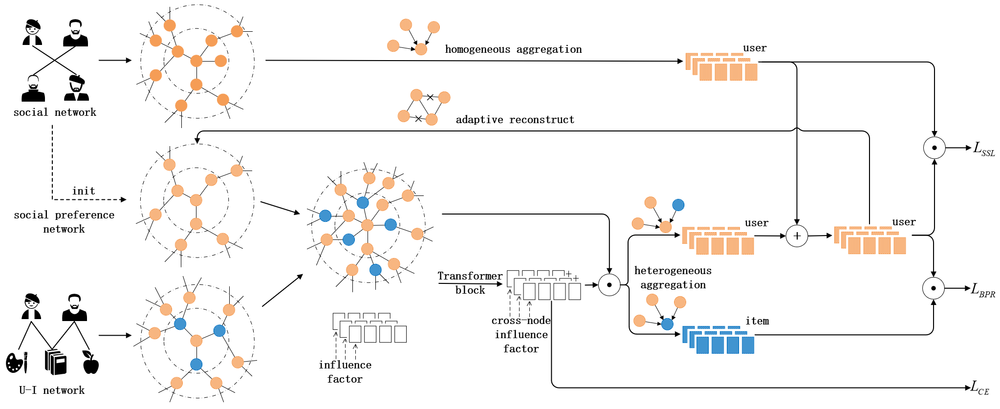

# Robust Preference-Guided based Disentangled Graph Social Recommendation
This repository is for RPGD model by <a href='https://github.com/Andrewsama'>@Andrewsama</a>, proposed in the following paper:

> Gang-Feng Ma, Xu-Hua Yang*, Yanbo Zhou, Haixia Long, Wei Huang, Weihua Gong. IEEE TNSE

<small>* denotes corresponding author</small>

## Introduction
Social recommendations introduce additional social information to capture users' potential item preferences, thereby providing more accurate recommendations. However, friends do not always have the same or similar preferences, which means that social information is redundant and often biased for user-item interaction network. In addition, current social recommendation models focus on the item-level preferences, neglecting the critical fine-grained preference influence factors. To address these issues, we propose the Robust Preference-Guided based Disentangled Graph Social Recommendation (RPGD). First, we employ a graph neural network to adaptively convert the social network into a social preference network based on social information and user-item interaction information, reducing bias between social relationships and preference relationships. Then, we propose a self-supervised learning method that utilizes the social network to constrain and optimize the social preference network, thereby enhancing the stability of the network. Finally, we propose a method for disentangling preference representation to explore fine-grained preference influence factors, that enhance the performance of user and item representations. We conducted experiments on some open-source real-world datasets, and the results show that RPGD outperforms the SOTA performance on social recommendations.



## Requirements
* python 3.9.18
* Pytorch 1.13.0
* DGL 0.5.x
* numpy 1.17+

## Usage
Please unzip the datasets first, and use the following commands. If OOM occurs, use --n_layers 1 instead.
```
python main.py --dataset Ciao --data_path datasets/ciao/dataset.pkl --val_neg_path datasets/ciao/val_neg_samples.pkl --test_neg_path datasets/ciao/test_neg_samples.pkl
```
```
python main.py --dataset Epinions --data_path datasets/epinions/dataset.pkl --val_neg_path datasets/epinions/val_neg_samples.pkl --test_neg_path datasets/epinions/test_neg_samples.pkl
```
```
python main.py --dataset Yelp --data_path datasets/yelp/dataset.pkl --val_neg_path datasets/yelp/val_neg_samples.pkl --test_neg_path datasets/yelp/test_neg_samples.pkl
```
